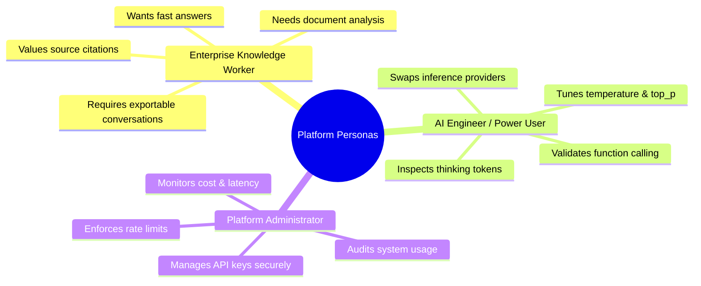
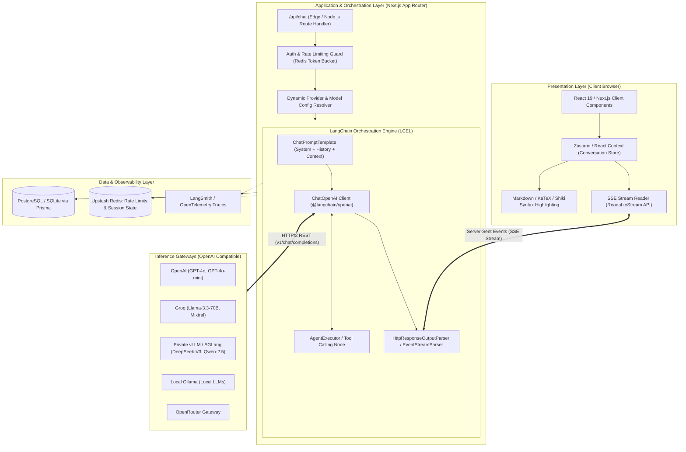
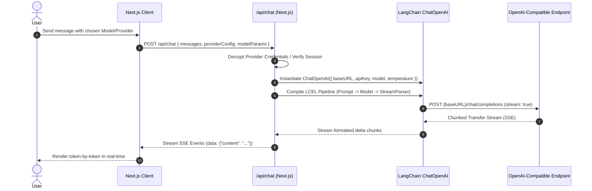
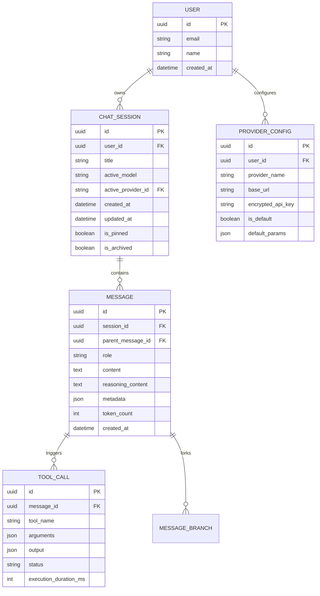
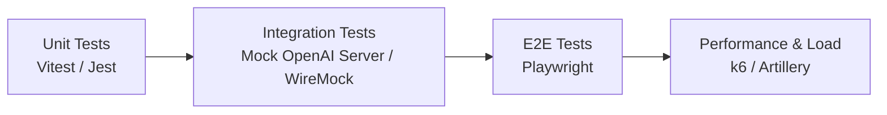

# Product Requirements Document (PRD)
## Enterprise Multi-Provider AI Chatbot Platform

| **Document Metadata** | **Details** |
| :--- | :--- |
| **Document Version** | 1.0.0 |
| **Status** | Approved for Architecture & Implementation |
| **Author** | Principal AI Solutions Architect (10+ YOE) |
| **Target Framework** | Next.js 15 (App Router, React 19, Server Components) |
| **AI Orchestration SDK** | LangChain.js (`@langchain/core`, `@langchain/openai`, LCEL) |
| **Target Endpoints** | OpenAI API & OpenAI-Compatible Gateways (vLLM, Ollama, Groq, OpenRouter, DeepSeek, Together AI, Azure) |
| **Persistence & Cache** | PostgreSQL / Prisma ORM + Upstash Redis |

---

## 1. Executive Summary & Strategic Vision

### 1.1 Executive Summary
Modern enterprise AI initiatives frequently suffer from vendor lock-in, fragmented developer experiences, inflexible model switching, and sub-optimal latency in chat interfaces. This project delivers an enterprise-grade, extensible, high-concurrency conversational AI platform built with **Next.js (App Router)** and **LangChain.js**. 

The core architectural innovation is a **universal OpenAI-compatible inference gateway** integrated seamlessly into LangChain's Expression Language (LCEL). This decoupling allows organizations to switch seamlessly between proprietary frontier models (OpenAI GPT-4o) and open-source or self-hosted models (vLLM, Ollama, DeepSeek-V3, Llama 3 on Groq or Together AI) by merely swapping `baseURL`, authentication credentials, and model identifiers, without touching application code.

### 1.2 Core Value Propositions
1. **Zero Vendor Lock-In**: Native support for any server or proxy implementing the OpenAI `v1/chat/completions` specification.
2. **Sub-500ms Time-to-First-Token (TTFT)**: High-throughput token streaming using HTTP/2 Server-Sent Events (SSE) and Edge-compatible `ReadableStream` pipelines.
3. **Enterprise Resilience & Observability**: End-to-end tracing via LangSmith, exponential backoff retries, fallback provider routing, and token consumption accounting.
4. **Extensible Agentic Foundation**: Native LangChain tool calling (dynamic structured tools, live web retrieval, calculator, code sandbox, and internal RAG).
5. **Polished Human-in-the-Loop UX**: Clean, accessible (WCAG 2.1 AA) interface featuring conversational branching, message editing, code execution sandboxes, KaTeX formula rendering, and collapsible reasoning/chain-of-thought blocks.

---

## 2. User Personas & Core Workflows

### 2.1 Target Personas



### 2.2 Core User Scenarios

1. **Low-Latency Streaming Interaction**: The user enters complex queries and receives instantaneous character-by-character responses with code syntax highlighting, collapsible thinking steps, and Markdown formatting.
2. **Dynamic Endpoint & Model Switching**: The user toggles from an OpenAI cloud endpoint to a local private instance (e.g., `http://localhost:11434/v1` for Ollama or private `vLLM` cluster) to adhere to internal data privacy policies.
3. **Message Regeneration & Branching**: The user edits a past prompt in the thread. The system branches the conversation tree while preserving the historical path for comparison.
4. **Tool-Assisted Execution**: The user prompts: *"Compare the stock performance of Nvidia vs AMD over the last 30 days and generate a comparison chart."* The agent invokes external tools (web search / financial API), synthesizes data, and renders interactive UI components.

---

## 3. High-Level System Architecture



---

## 4. Detailed Component Architecture & Tech Stack

### 4.1 Technology Stack Matrix

| Layer | Selected Technology | Rationale & Architectural Justification |
| :--- | :--- | :--- |
| **Framework** | **Next.js 15 (App Router)** | Hybrid SSR, RSC for fast initial paint, Node/Edge serverless API routes, optimized asset bundling. |
| **Language** | **TypeScript 5.x (Strict)** | Static type safety across client state, API boundaries, and LangChain message schemas. |
| **AI SDK** | **`@langchain/openai` + `@langchain/core`** | Standardized LCEL, native support for `baseURL` overrides, robust tool binding, and streaming abstractions. |
| **UI Library** | **Tailwind CSS + Shadcn UI (Radix UI)** | Zero runtime CSS overhead, accessible keyboard navigation, flexible theme customization (Dark/Light). |
| **Markdown / Code** | **`react-markdown` + `remark-gfm` + `rehype-katex` + `shiki`** | Flawless GFM tables, math notation rendering, zero-hydration-flicker code syntax highlighting. |
| **State Management** | **Zustand + TanStack Query** | Lightweight client state for active streaming sessions; optimistic UI updates for chat history. |
| **Database & ORM** | **PostgreSQL + Prisma / Drizzle** | Relational integrity for conversations, messages, token audits, and user provider profiles. |
| **Rate Limiting** | **Upstash Redis (`@upstash/ratelimit`)** | Distributed low-latency rate limiting per IP or authenticated user session. |
| **Observability** | **LangSmith + Winston Structured Logger** | Tracing prompt latency, token count, tool execution graphs, and error telemetry. |

---

## 5. Functional Requirements (FR)

### FR-1: OpenAI-Compatible Provider Gateway



- **Universal Endpoint Adapter**: The backend accepts any valid `baseURL` (e.g., `https://api.groq.com/openai/v1`, `http://localhost:11434/v1`, `https://openrouter.ai/api/v1`, or private on-premise clusters).
- **Dynamic Configuration Injection**:
  - `baseURL`: String (URL validation required, SSRF prevention via internal IP blocklist).
  - `apiKey`: String (encrypted with AES-256-GCM when saved in DB; decrypted in memory only within Route Handler).
  - `modelName`: Dynamic string allowing arbitrary model identifiers (`gpt-4o`, `deepseek-chat`, `llama-3.3-70b-versatile`, `qwen2.5-coder:32b`).
- **Inference Parameter Controls**:
  - `temperature`: Float range `[0.0, 2.0]`, default `0.7`.
  - `top_p`: Float range `[0.0, 1.0]`, default `1.0`.
  - `max_tokens`: Integer range `[1, 128000]`.
  - `presence_penalty` / `frequency_penalty`: Float range `[-2.0, 2.0]`.
  - `system_prompt`: Custom instructions prepended as `SystemMessage`.

### FR-2: Ultra-Low Latency Streaming & Transport Protocol
- **Transport Mechanism**: Server-Sent Events (SSE) via HTTP/2, utilizing Next.js `ReadableStream` response.
- **Event Protocol Definition**:
  - `event: token` -> Delivers incremental content string `{ "content": "..." }`.
  - `event: reasoning` -> Delivers reasoning / thinking tokens for models like DeepSeek-R1 or o1/o3-mini.
  - `event: tool_call` -> Delivers tool invocation metadata `{ "name": "search", "args": {...} }`.
  - `event: tool_result` -> Delivers tool execution results back to the client.
  - `event: error` -> Delivers graceful error code and human-readable recovery suggestions.
  - `event: done` -> Delivers completion metadata `{ "finish_reason": "stop", "usage": { "prompt_tokens": 150, "completion_tokens": 82 } }`.
- **Stream Controls**:
  - User can click **"Stop Generating"** at any millisecond: triggers an `AbortController.abort()` signal propagating from the browser through Next.js server to the remote inference socket.
  - Client auto-reconnects on transient network drops with backoff.

### FR-3: Multi-Turn Conversation & Session Lifecycle
- **Session Threading**:
  - Sidebar displaying recent conversations grouped chronologically (*Today*, *Yesterday*, *Previous 7 Days*, *Older*).
  - Automatic Title Generation: Upon completion of the first round-trip turn, a background lightweight LLM call generates a crisp 3-to-5 word title.
  - Session Actions: Rename, Pin, Duplicate, Archive, and Soft/Hard Delete.
- **Message Branching & Editing**:
  - Users can edit any previous human message in the timeline.
  - Editing forks a new branch version (`v1`, `v2`, `v3`) with pagination arrows (`< 1/3 >`) to traverse alternative generation histories without losing context.
  - Users can trigger "Regenerate Response" with identical or alternate model parameters.

### FR-4: Rich Content Rendering & Artifacts
- **Markdown & Math Processing**:
  - Full GitHub Flavored Markdown (GFM) support: tables, strikethrough, autolinks, nested task lists.
  - KaTeX mathematical notation support for inline `$...$` and display blocks `$$...$$`.
- **Code Engine**:
  - Syntax highlighting for 80+ programming languages via Shiki (clean server/client rendering with zero theme jitter).
  - One-click "Copy Code" with toast notification.
  - Display language badge, line count, and optional line numbers.
- **Reasoning / Thinking Disclosure**:
  - Expandable/collapsible accordion block for models emitting `<think>` tags (e.g., DeepSeek-R1, QwQ). Displays live streaming thought process without cluttering final output.

### FR-5: Function Calling & Extensible LangChain Tools
- **Tool Registry Architecture**:
  - Modular registration using LangChain's `DynamicStructuredTool` or `@langchain/core/tools`.
  - Built-in Initial Tools:
    1. **Web Search Tool**: Tavily / DuckDuckGo search integration for real-time web retrieval.
    2. **Code Execution Sandbox**: Secure Python / JavaScript client-side or microVM sandbox (e.g., Pyodide / E2B).
    3. **Calculator / Math Engine**: Deterministic symbolic evaluation via `mathjs`.
- **Human-in-the-Loop Confirmation**:
  - Sensitive tools (e.g., database writes, external mutations) yield a paused execution state requiring explicit user approval via UI action button.

### FR-6: Context Window Management & Smart Memory
- **Token-Aware Window Trimming**:
  - LangChain memory manager tracking cumulative token count using model-specific tokenizers (`tiktoken` / `js-tiktoken`).
  - Automatic summarization or sliding window truncation when approaching the context limit (e.g., reserving 20% of context window for completion).
- **Prompt Injection Defense**:
  - Input sanitization layer stripping dangerous delimiters and neutralizing jailbreak patterns before execution.

---

## 6. Database Schema & Data Models



### 6.1 Prisma Schema Specification

```prisma
datasource db {
  provider = "postgresql"
  url      = env("DATABASE_URL")
}

generator client {
  provider = "prisma-client-js"
}

enum Role {
  system
  user
  assistant
  tool
}

model User {
  id              String           @id @default(uuid())
  email           String           @unique
  name            String?
  providerConfigs ProviderConfig[]
  sessions        ChatSession[]
  createdAt       DateTime         @default(now())
  updatedAt       DateTime         @updatedAt
}

model ProviderConfig {
  id              String        @id @default(uuid())
  userId          String
  user            User          @relation(fields: [userId], references: [id], onDelete: Cascade)
  providerName    String        // e.g., "OpenAI", "Groq", "Local vLLM", "Ollama"
  baseUrl         String        // e.g., "http://localhost:11434/v1"
  encryptedKey    String?       // Encrypted with AES-256-GCM
  isDefault       Boolean       @default(false)
  defaultModel    String        @default("gpt-4o")
  parameters      Json          @default("{\"temperature\":0.7,\"topP\":1.0}")
  sessions        ChatSession[]
  createdAt       DateTime      @default(now())

  @@index([userId])
}

model ChatSession {
  id          String         @id @default(uuid())
  userId      String
  user        User           @relation(fields: [userId], references: [id], onDelete: Cascade)
  providerId  String?
  provider    ProviderConfig? @relation(fields: [providerId], references: [id], onDelete: SetNull)
  title       String         @default("New Chat")
  modelName   String
  isPinned    Boolean        @default(false)
  isArchived  Boolean        @default(false)
  messages    Message[]
  createdAt   DateTime       @default(now())
  updatedAt   DateTime       @updatedAt

  @@index([userId, updatedAt])
}

model Message {
  id               String       @id @default(uuid())
  sessionId        String
  session          ChatSession  @relation(fields: [sessionId], references: [id], onDelete: Cascade)
  parentMessageId  String?
  parentMessage    Message?     @relation("MessageTree", fields: [parentMessageId], references: [id])
  childMessages    Message[]    @relation("MessageTree")
  role             Role
  content          String       @db.Text
  reasoningContent String?      @db.Text
  tokenCount       Int?
  modelName        String?
  toolCalls        ToolCall[]
  createdAt        DateTime     @default(now())

  @@index([sessionId, createdAt])
}

model ToolCall {
  id           String   @id @default(uuid())
  messageId    String
  message      Message  @relation(fields: [messageId], references: [id], onDelete: Cascade)
  toolName     String
  inputArgs    Json
  outputResult Json?
  isError      Boolean  @default(false)
  durationMs   Int?
  createdAt    DateTime @default(now())

  @@index([messageId])
}
```

---

## 7. API Specifications & Contracts

### 7.1 POST `/api/chat` (Core Streaming Route)
- **Method**: `POST`
- **Headers**:
  - `Content-Type: application/json`
  - `Accept: text/event-stream`
- **Request Payload**:
```json
{
  "sessionId": "b48c1e84-18df-4a6c-bf92-6a6c0b987654",
  "messages": [
    { "role": "system", "content": "You are an expert software engineer." },
    { "role": "user", "content": "Write an idiomatic LRU cache in TypeScript." }
  ],
  "provider": {
    "baseUrl": "https://api.openai.com/v1",
    "apiKey": "sk-...",
    "model": "gpt-4o"
  },
  "parameters": {
    "temperature": 0.5,
    "maxTokens": 4096,
    "topP": 0.95
  },
  "enableTools": true
}
```

- **Response**: `200 OK` with `Content-Type: text/event-stream; charset=utf-8`
- **Stream Output Protocol**:
```
event: token
data: {"content": "class"}

event: token
data: {"content": " LRU"}

event: token
data: {"content": "Cache<K, V> {"}

event: done
data: {"finish_reason": "stop", "usage": {"prompt_tokens": 28, "completion_tokens": 142}}
```

### 7.2 LangChain Implementation Architecture (Route Handler)

```typescript
// Architectural Blueprint for /app/api/chat/route.ts
import { NextRequest } from "next/server";
import { ChatOpenAI } from "@langchain/openai";
import { HumanMessage, AIMessage, SystemMessage } from "@langchain/core/messages";
import { HttpResponseOutputParser } from "langchain/output_parsers";

export const runtime = "nodejs"; // or "edge" if using edge-compatible crypto

export async function POST(req: NextRequest) {
  const { messages, provider, parameters } = await req.json();

  // 1. Validate & sanitize target endpoint
  const targetBaseUrl = provider.baseUrl || "https://api.openai.com/v1";
  validateEndpointUrl(targetBaseUrl); // Block internal RFC-1918 IPs (SSRF guard)

  // 2. Instantiate OpenAI-compatible LangChain client
  const model = new ChatOpenAI({
    openAIApiKey: provider.apiKey || process.env.OPENAI_API_KEY,
    configuration: {
      baseURL: targetBaseUrl,
    },
    modelName: provider.model || "gpt-4o",
    temperature: parameters?.temperature ?? 0.7,
    maxTokens: parameters?.maxTokens ?? 2048,
    streaming: true,
  });

  // 3. Transform client wire format into LangChain Core messages
  const formattedMessages = messages.map((msg: any) => {
    switch (msg.role) {
      case "system": return new SystemMessage(msg.content);
      case "assistant": return new AIMessage(msg.content);
      default: return new HumanMessage(msg.content);
    }
  });

  // 4. Construct LCEL streaming chain
  const parser = new HttpResponseOutputParser();
  const stream = await model.pipe(parser).stream(formattedMessages);

  // 5. Return standards-compliant streaming response
  return new Response(stream, {
    headers: {
      "Content-Type": "text/event-stream; charset=utf-8",
      "Cache-Control": "no-cache, no-transform",
      "Connection": "keep-alive",
    },
  });
}
```

---

## 8. Non-Functional Requirements (NFR)

### 8.1 Performance & Latency
| Metric | Threshold | Architectural Strategy |
| :--- | :--- | :--- |
| **Time-to-First-Token (TTFT)** | `< 450 ms` | Direct stream piping via `HttpResponseOutputParser`, zero intermediate server-side buffering, HTTP/2 multiplexing. |
| **Chat Page Initial Load (LCP)** | `< 1.2 s` | Server-rendered initial skeleton, lazy-loaded KaTeX/Shiki dependencies via dynamic imports. |
| **Client Memory Footprint** | `< 75 MB` | Virtualized message rendering (`@tanstack/react-virtual`) for threads exceeding 100 turns. |
| **Max Concurrent Streams** | `5,000+` | Stateless serverless API route architecture decoupled from DB writes via background webhooks/jobs. |

### 8.2 Security, Compliance & Safety
1. **Zero-Knowledge API Key Storage**: User-provided API keys are encrypted at rest using AES-256-GCM with PBKDF2 key derivation. Keys are never logged, never exposed to client-side analytics, and decrypted in-memory only during route execution.
2. **Server-Side Request Forgery (SSRF) Defense**: Custom `baseURL` inputs are strictly validated. Requests resolving to `127.0.0.1`, `10.0.0.0/8`, `172.16.0.0/12`, `169.254.169.254` (cloud metadata service), or `::1` are blocked in production environments unless explicitly authorized by a system administrator flag.
3. **Content Security Policy (CSP)**: Strict script-src and connect-src rules enforcing allowed remote endpoints.
4. **Input Sanitization**: Defense-in-depth sanitization of input payloads against script injection (XSS) and prompt extraction vectors.

### 8.3 Accessibility & Internationalization
- **WCAG 2.1 AA Compliance**: Contrast ratios $\ge 4.5:1$, visible focus rings, full keyboard accessibility (`Cmd/Ctrl + K` for search, `Enter` to submit, `Shift + Enter` for newline, `Esc` to halt generation).
- **Screen Reader Optimization**: ARIA live regions (`aria-live="polite"`) announcing incoming streamed messages.

---

## 9. Testing & Quality Assurance Strategy



1. **Unit Testing (Vitest)**:
   - Message parser and LCEL pipeline transformation tests.
   - Encryption/decryption round-trip tests for provider secrets.
   - Token counting accuracy benchmarks.
2. **Integration Testing**:
   - Mocked OpenAI-compatible endpoint simulating high latency, network timeouts, chunk splits, and malformed SSE frames.
   - Tool calling parsing and invocation verification.
3. **End-to-End (E2E) Testing (Playwright)**:
   - Full flow: Session creation $\rightarrow$ Model selection $\rightarrow$ Prompt entry $\rightarrow$ Token streaming $\rightarrow$ Message edit $\rightarrow$ Branch switch $\rightarrow$ Export.
4. **Load & Stress Testing (k6)**:
   - Simulating 500 concurrent active SSE streams against a mock inference server to verify node event loop health and socket leak absence.

---

## 10. Phased Implementation Roadmap

### Phase 1: Core Foundation & Streaming Engine (Weeks 1 - 2)
- Scaffold Next.js 15 App Router project with Tailwind CSS, Shadcn UI, and Lucide icons.
- Implement `@langchain/openai` and `@langchain/core` integration in `/api/chat`.
- Build the dynamic provider resolver supporting customizable `baseURL` and `modelName`.
- Build client-side chat interface with SSE stream consumption and basic auto-scroll.
- Implement stop-generation via `AbortController`.

### Phase 2: Persistence, Session Lifecycle & Markdown Engine (Weeks 3 - 4)
- Setup PostgreSQL schema with Prisma ORM (Users, Sessions, Messages).
- Implement multi-turn conversational history persistence and sidebar session list.
- Add background title generation on initial turn.
- Integrate full Markdown stack: GFM tables, KaTeX math typesetting, Shiki code syntax highlighting with copy-to-clipboard.
- Implement message editing and conversation branching (`MessageTree`).

### Phase 3: Reasoning Blocks, Provider Management & Tools (Weeks 5 - 6)
- Add expandable/collapsible accordion for reasoning tokens (`<think>` blocks).
- Build Provider Management settings modal: securely save custom endpoints (Ollama, Groq, vLLM, OpenRouter) with AES-256 encrypted storage.
- Implement LangChain tool calling framework with initial tools: Web Search (Tavily), Calculator, and Code Sandbox.
- Integrate token usage calculations and session cost metrics.

### Phase 4: Enterprise Hardening, Observability & Security (Weeks 7 - 8)
- Integrate LangSmith tracing and OpenTelemetry instrumentation.
- Implement Upstash Redis distributed rate limiting and SSRF protection filter.
- Comprehensive security audit (AES key handling, input sanitization, CSP rules).
- End-to-End automated testing suite via Playwright.
- Production deployment orchestration (Docker, Vercel / Kubernetes, CI/CD pipeline).

---

## 11. Risk Assessment & Mitigation Matrix

| Risk Event | Severity | Probability | Architectural Mitigation |
| :--- | :--- | :--- | :--- |
| **Inference Server Slowdowns / Hanging Sockets** | High | Medium | Implement aggressive client/server timeouts, streaming keep-alive heartbeats, and circuit breakers with fallback model routing. |
| **Server-Side Request Forgery (SSRF) via Custom Endpoints** | Critical | Medium | Validate URLs against strict DNS resolution checks. Disallow private IP ranges and cloud instance metadata addresses (`169.254.169.254`). |
| **Context Window Overflow** | Medium | High | Implement proactive token budget counting in LangChain; prune or summarize oldest historical turns prior to sending to model. |
| **High Concurrency Connection Exhaustion** | High | Low | Leverage stateless HTTP streaming, avoid holding long-lived DB transactions during LLM token emission. |
| **Provider API Key Exfiltration** | Critical | Low | Keep keys strictly server-side. Encrypt at rest with AES-256-GCM. Reject any client requests attempting to fetch raw keys. |

---

## 12. Sign-Off & Approval

| Role | Name | Signature | Date |
| :--- | :--- | :--- | :--- |
| **Principal AI Architect** | Antigravity AI Architecture Team | *Approved* | 2026-09-10 |
| **Lead Full-Stack Engineer** | Project Engineering Lead | *Pending* | - |
| **Product Manager** | Executive Stakeholder | *Pending* | - |
