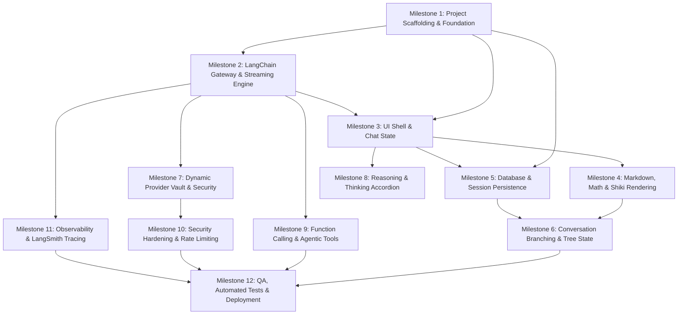

# Project Implementation Task Plan (`task.md`)
## Enterprise Multi-Provider AI Chatbot Platform

**Reference Document**: [PRD.md](file:///Users/jarvis/vibe/demo_vibe/PRD.md)  
**Architecture Lead**: Principal AI Solutions Architect  
**Status**: Ready for Execution  

---

## 1. High-Level Dependency Graph

---

## Milestone 1: Project Scaffolding, Tooling & Core Setup

- [ ] **TASK-1.1: Initialize Next.js 15 Project with TypeScript & Tailwind CSS**
  - **Description**: Scaffold Next.js 15 with App Router, TypeScript strict mode, Tailwind CSS v4 / v3.4, and standard linting.
  - **Key Files**: `package.json`, `tsconfig.json`, `tailwind.config.ts`, `app/layout.tsx`, `app/globals.css`.
  - **Acceptance Criteria**:
    - Clean `npm run dev` builds with zero warnings.
    - Path aliases (`@/*`) configured and resolving cleanly.
    - Global font (`Inter` or `Geist`) and dark-mode CSS variables initialized.

- [ ] **TASK-1.2: Install & Configure Shadcn UI Primitives & Lucide Icons**
  - **Description**: Initialize Shadcn UI component system with Radix UI primitives.
  - **Components Required**: `Button`, `Input`, `Textarea`, `DropdownMenu`, `Dialog`, `Sheet`, `Tooltip`, `ScrollArea`, `Accordion`, `Badge`, `Skeleton`.
  - **Acceptance Criteria**:
    - Components installed in `components/ui/*`.
    - Fully functioning dark/light mode toggle via `next-themes`.

- [ ] **TASK-1.3: Install LangChain Core & AI Dependencies**
  - **Description**: Install `@langchain/core`, `@langchain/openai`, `langchain`, `zod`, `eventsource-parser`, and `ai` (Vercel AI SDK core utilities if needed).
  - **Acceptance Criteria**:
    - All packages successfully resolved in `package.json` with no peer dependency conflicts.

---

## Milestone 2: Core LangChain Inference Gateway & Streaming Route

- [ ] **TASK-2.1: Implement Dynamic Provider Configuration Types & Validator**
  - **Description**: Define TypeScript interfaces and Zod schemas for provider configurations (`baseURL`, `apiKey`, `modelName`, `temperature`, `topP`, `maxTokens`).
  - **Key Files**: `lib/types/provider.ts`, `lib/validations/chat.ts`.
  - **Acceptance Criteria**:
    - Validation passes for valid URLs (e.g. `https://api.openai.com/v1`, `http://localhost:11434/v1`).
    - Malformed URLs or disallowed parameters trigger standard HTTP 400 with structured error responses.

- [ ] **TASK-2.2: Build Core LCEL Pipeline & Factory**
  - **Description**: Create factory function `createChatModel(providerConfig)` returning a configured `ChatOpenAI` instance bound to custom `baseURL` and credentials.
  - **Key Files**: `lib/ai/model-factory.ts`.
  - **Acceptance Criteria**:
    - Properly routes to OpenAI, Groq, Ollama, or vLLM endpoints based on runtime parameters.
    - Handles model-specific capabilities (e.g., streaming flag, custom headers).

- [ ] **TASK-2.3: Implement `/api/chat` Route Handler with SSE Streaming**
  - **Description**: Implement Next.js App Router POST handler using `HttpResponseOutputParser` to emit Server-Sent Events (SSE).
  - **Key Files**: `app/api/chat/route.ts`.
  - **Acceptance Criteria**:
    - Emits standard SSE frames (`data: {"content": "..."}\n\n`).
    - Supports client abort via `req.signal`.
    - Returns structured error frames on upstream API failures (401, 429, 500).

- [ ] **TASK-2.4: Build Client-Side SSE Stream Consumer**
  - **Description**: Create a custom hook `useChatStream` using the browser `ReadableStream` reader and `AbortController`.
  - **Key Files**: `hooks/use-chat-stream.ts`.
  - **Acceptance Criteria**:
    - Instantaneous rendering of tokens without batching latency.
    - Seamless cancellation when calling `stop()`.
    - Handles unexpected connection drops with user-friendly error banners.

---

## Milestone 3: Presentation Layer, Chat UI & State Management

- [ ] **TASK-3.1: Build Application Layout & Responsive Shell**
  - **Description**: Implement responsive desktop sidebar (collapsible) and mobile sheet drawer navigation.
  - **Key Files**: `app/(chat)/layout.tsx`, `components/sidebar/chat-sidebar.tsx`, `components/header/chat-header.tsx`.
  - **Acceptance Criteria**:
    - Smooth collapsible sidebar state persisted in `localStorage`.
    - Clean mobile breakpoint behavior (<768px).

- [ ] **TASK-3.2: Implement Zustand Chat Store**
  - **Description**: Global state management for active session, message list, streaming status, model selector, and temporary draft input.
  - **Key Files**: `lib/store/chat-store.ts`.
  - **Acceptance Criteria**:
    - Atomic updates ensuring UI does not re-render unnecessary list items during streaming.
    - Easy serializability for local cache hydration.

- [ ] **TASK-3.3: Build Auto-Resizing Chat Input Bar**
  - **Description**: Rich prompt input with auto-growing textarea (`react-textarea-autosize`), keyboard shortcuts (`Enter` to submit, `Shift + Enter` for line break), and file/tool attachment triggers.
  - **Key Files**: `components/chat/chat-input.tsx`.
  - **Acceptance Criteria**:
    - Height caps at 200px before showing internal scrollbar.
    - Submit disabled when empty or actively generating.
    - Stop generation button appears dynamically during active generation.

- [ ] **TASK-3.4: Implement Virtualized Message List & Auto-Scroll Engine**
  - **Description**: Build chat stream viewport with smart auto-scrolling that sticks to bottom during streaming unless user manually scrolls up.
  - **Key Files**: `components/chat/message-list.tsx`, `components/chat/message-bubble.tsx`.
  - **Acceptance Criteria**:
    - "Scroll to bottom" button appears when user scrolls above viewport during streaming.
    - Smooth animations without frame drops.

---

## Milestone 4: Rich Markdown, Math (KaTeX) & Code Highlighting

- [ ] **TASK-4.1: Integrate Markdown Pipeline with GFM & KaTeX**
  - **Description**: Configure `react-markdown` with `remark-gfm`, `remark-math`, and `rehype-katex`.
  - **Key Files**: `components/chat/markdown-renderer.tsx`.
  - **Acceptance Criteria**:
    - Inline formulas (`$E=mc^2$`) and block equations (`$$\int_0^\infty...$$`) render crisply with KaTeX fonts.
    - GFM tables, checkboxes, blockquotes, and strikethroughs render styled Tailwind components.

- [ ] **TASK-4.2: Build High-Performance Code Block Component (Shiki)**
  - **Description**: Custom code block with Shiki syntax highlighting, language badge, line count, and one-click copy button.
  - **Key Files**: `components/chat/code-block.tsx`.
  - **Acceptance Criteria**:
    - Copy button toggles to a green checkmark with toast confirmation.
    - Supports dark and light theme code palettes without flickering.
    - Gracefully handles unknown languages or malformed code chunks during live streaming.

---

## Milestone 5: Database & Session Persistence (MongoDB & Mongoose)

- [x] **TASK-5.1: Configure MongoDB Connection & Mongoose Schemas**
  - **Description**: Configure cached MongoDB client connection for Next.js App Router and define Mongoose schemas for `ChatSession`, `Message` (with tree support), and `ProviderConfig`.
  - **Key Files**: `lib/db/mongodb.ts`, `lib/db/models/ChatSession.ts`, `lib/db/models/Message.ts`, `lib/db/models/ProviderConfig.ts`, `lib/db/index.ts`.
  - **Acceptance Criteria**:
    - Connection caching prevents socket exhaustion across Next.js serverless route invocations.
    - Compound indexes on `[sessionId, createdAt]` and `[updatedAt]` defined.
    - TypeScript strict type validation passes with zero errors.

- [ ] **TASK-5.2: Implement Session CRUD Route Handlers**
  - **Description**: REST API routes for listing, creating, renaming, pinning, and deleting chat sessions.
  - **Key Files**: `app/api/sessions/route.ts`, `app/api/sessions/[sessionId]/route.ts`.
  - **Acceptance Criteria**:
    - Cascade deletes session messages when a session is deleted.
    - Optimistic updates in UI via TanStack Query or Zustand.

- [ ] **TASK-5.3: Automated Title Generation Pipeline**
  - **Description**: Trigger background lightweight completion on the first exchange to summarize the prompt into a 3-5 word title.
  - **Key Files**: `lib/ai/title-generator.ts`.
  - **Acceptance Criteria**:
    - Executes asynchronously without blocking response stream.
    - Replaces default "New Chat" title seamlessly.

---

## Milestone 6: Conversation Branching & Message Editing

- [ ] **TASK-6.1: Implement Tree-Structured Message Schema**
  - **Description**: Support `parentMessageId` on messages to allow arbitrary tree forks.
  - **Key Files**: `lib/types/chat.ts`, `lib/utils/message-tree.ts`.
  - **Acceptance Criteria**:
    - Helper function `getActiveBranch(messages, activeLeafId)` reconstructs linear conversation turn list.

- [ ] **TASK-6.2: Build Message Edit & Fork UI**
  - **Description**: Allow user to hover and click "Edit" on any previous human message, modify text, and branch.
  - **Key Files**: `components/chat/message-edit-dialog.tsx`, `components/chat/branch-selector.tsx`.
  - **Acceptance Criteria**:
    - Displays pagination arrows (`< 2/3 >`) below branched messages.
    - Switching branches updates all downstream child messages instantly.

- [ ] **TASK-6.3: Implement "Regenerate Response" Workflow**
  - **Description**: One-click regeneration button on assistant messages that forks a new sibling assistant response from the same parent user message.
  - **Acceptance Criteria**:
    - Previous response preserved in tree history.

---

## Milestone 7: Dynamic Provider Management & Secure Credential Vault

- [ ] **TASK-7.1: Build Provider Settings Modal**
  - **Description**: UI modal allowing users to configure presets (OpenAI, Groq, Ollama, vLLM, OpenRouter, Custom).
  - **Key Files**: `components/settings/provider-settings-modal.tsx`, `components/settings/provider-form.tsx`.
  - **Acceptance Criteria**:
    - Fields for Base URL, API Key, Model Name, Default Temperature, Max Tokens.
    - "Test Connection" button that runs a ping prompt against the specified endpoint.

- [ ] **TASK-7.2: Implement AES-256-GCM Encryption Service**
  - **Description**: Server-side symmetric encryption utility for user API keys stored in database.
  - **Key Files**: `lib/security/crypto.ts`.
  - **Acceptance Criteria**:
    - Never stores plaintext API keys in DB.
    - Decryption happens exclusively in server memory during `/api/chat` calls.
    - Zero key leaks in client payloads or server logs.

---

## Milestone 8: Reasoning / Thinking Tokens (`<think>` Accordion)

- [ ] **TASK-8.1: Implement Reasoning Stream Parser**
  - **Description**: Parser detecting `<think>` ... `</think>` tags or provider-specific reasoning fields (e.g. DeepSeek-R1, o1).
  - **Key Files**: `lib/ai/reasoning-parser.ts`.
  - **Acceptance Criteria**:
    - Splits reasoning tokens into a separate event stream or structured object.

- [ ] **TASK-8.2: Build Interactive Collapsible Thinking UI**
  - **Description**: Render a sleek expandable accordion above the response with pulsating "Thinking..." indicator during generation, elapsed duration timer, and token count.
  - **Key Files**: `components/chat/thinking-block.tsx`.
  - **Acceptance Criteria**:
    - Auto-collapses on completion (configurable by user preference).
    - Can be toggled open/closed at any time.

---

## Milestone 9: Agentic Function Calling & External Tools

- [ ] **TASK-9.1: Build LangChain Tool Registry**
  - **Description**: Define extensible tool registry using LangChain `DynamicStructuredTool`.
  - **Key Files**: `lib/ai/tools/index.ts`.
  - **Initial Tools**:
    1. `webSearchTool` (Tavily or DuckDuckGo API).
    2. `calculatorTool` (`mathjs` evaluation).
    3. `weatherTool` / `customApiTool`.
  - **Acceptance Criteria**:
    - Dynamic schema validation via Zod.
    - Returns structured JSON to model.

- [ ] **TASK-9.2: Implement Tool Execution Event Stream & UI Widget**
  - **Description**: Stream tool call start, arguments, execution status, and results to client.
  - **Key Files**: `components/chat/tool-invocation-badge.tsx`.
  - **Acceptance Criteria**:
    - Shows "Searching the web...", "Running calculation...", etc.
    - Expandable inspection badge showing tool input and output.

---

## Milestone 10: Security Hardening & Rate Limiting

- [ ] **TASK-10.1: Implement Server-Side Request Forgery (SSRF) Guard**
  - **Description**: Inspect and resolve all custom `baseURL` inputs before HTTP dispatch.
  - **Key Files**: `lib/security/ssrf-guard.ts`.
  - **Acceptance Criteria**:
    - Blocks private IP ranges (`10.0.0.0/8`, `172.16.0.0/12`, `192.168.0.0/16`, `127.0.0.1`, `::1`).
    - Blocks cloud metadata endpoints (`169.254.169.254`).
    - Allows localhost ONLY if explicit `ALLOW_LOCAL_INFERENCE=true` flag is set in `.env.local`.

- [ ] **TASK-10.2: Implement Upstash Redis Rate Limiting**
  - **Description**: Token bucket rate limiter limiting requests per IP and per authenticated user.
  - **Key Files**: `lib/security/ratelimit.ts`.
  - **Acceptance Criteria**:
    - Emits standard `429 Too Many Requests` with `Retry-After` header when limit exceeded.

---

## Milestone 11: Observability & LangSmith Tracing

- [ ] **TASK-11.1: Integrate LangSmith & OpenTelemetry**
  - **Description**: Instrument LangChain pipeline with `LANGCHAIN_TRACING_V2=true` and custom metadata tags.
  - **Key Files**: `lib/ai/observability.ts`.
  - **Acceptance Criteria**:
    - Complete trace of prompt, latency, tokens, and tool calls visible in LangSmith dashboard.
    - Zero performance degradation on client streaming.

- [ ] **TASK-11.2: Add Structured JSON Application Logging**
  - **Description**: Winston/Pino logger recording request IDs, session IDs, model parameters, and error stacks.
  - **Acceptance Criteria**:
    - Sensitive data (passwords, API keys, user message content) masked in production logs.

---

## Milestone 12: QA, Automated Testing & Production Deployment

- [ ] **TASK-12.1: Implement Vitest Unit Tests**
  - **Description**: Unit tests for message tree branching, SSRF validator, crypto service, and markdown parser.
  - **Target**: $>85\%$ test coverage on utility and security modules.

- [ ] **TASK-12.2: Implement Playwright E2E Integration Suite**
  - **Description**: End-to-end user journeys: create chat, stream reply, switch provider, edit message, verify branching.

- [ ] **TASK-12.3: Containerization & Dockerfile**
  - **Description**: Multi-stage production `Dockerfile` optimized for standalone Next.js deployment.
  - **Key Files**: `Dockerfile`, `docker-compose.yml`, `.dockerignore`.
  - **Acceptance Criteria**:
    - Image size $< 200\text{MB}$.
    - Passes non-root security container checks.

---

## 2. Sprint Planning & Work Streams

| Work Stream | Owner / Track | Milestones Covered | Estimated Velocity |
| :--- | :--- | :--- | :--- |
| **Stream A: AI Core & Backend Gateway** | Senior AI / Backend Engineer | M2, M7, M9, M10, M11 | Sprints 1 - 3 |
| **Stream B: Frontend & UX Experience** | Senior Frontend / Design Engineer | M1, M3, M4, M6, M8 | Sprints 1 - 3 |
| **Stream C: Persistence, DevOps & Quality** | Full-Stack / Platform Engineer | M1, M5, M10, M12 | Sprints 2 - 4 |

---

## 3. Definition of Done (DoD) Checklist

For any task to be marked `[x] Complete`:
1. **Code Standards**: 100% TypeScript type check passes (`tsc --noEmit`).
2. **Linting & Formatting**: Zero ESLint warnings (`npm run lint`), Prettier formatted.
3. **Security Check**: Passes SSRF and credential leak inspection.
4. **Test Verification**: Unit or integration test written and passing.
5. **Cross-Browser & Responsive**: Verified on desktop Chrome/Safari and mobile Safari viewport.
6. **Documentation**: Code comments on complex algorithms; API contract changes updated in [PRD.md](file:///Users/jarvis/vibe/demo_vibe/PRD.md).
